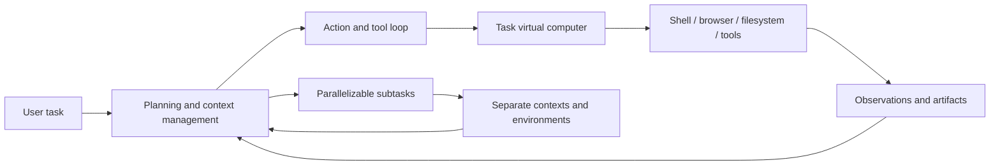
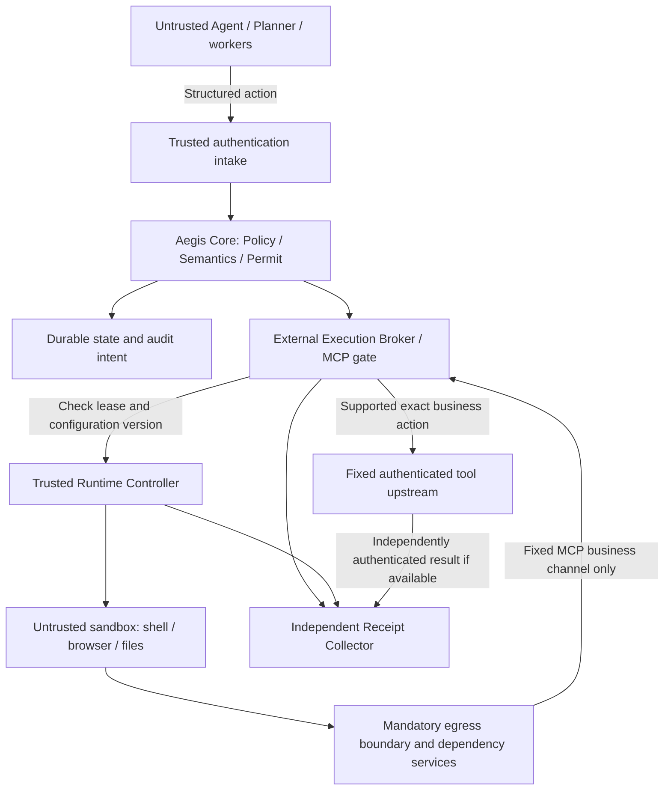

# Aegis Router redesign: connect execution permits to a trusted boundary outside the sandbox

English | [简体中文](manus-redesign.zh-CN.md)

Reviewed: 2026-09-13. Code baseline: `11451c58d583041e4009d8799bfd07b17199b481`.

Status: **M1 implemented on 2026-09-14; M2–M4 remain design proposals**. This document retains the 2026-09-13 research baseline, architecture and acceptance plan. The [M1 implementation record](m1-execution-admission.md) documents actual code changes and E02/E07 comparisons. Chinese is the semantic source. External findings remain `V1`; only the local code finding was reproduced.

## 1. Recommended product direction

2026-09-15 update: the [authorization/execution binding review](authorization-execution-binding.md) fixes a top-level RPC parser differential and proposes `PreparedExecution`, route-configuration binding, and resource versions as experiments before M2. Durable transactions and external environment integrations below remain pending.

Keep CanonicalAction, deterministic Policy, signed Permits, workload proof, and the MCP gate. Make the next version an **execution-permit boundary that checks execution prerequisites**: an external executor gets one execution opportunity only when the current workload, environment, and exact action match.

Extend the question from whether a request was authorized to whether this exact authorized action can be dispatched now in an environment satisfying its constraints. This preserves the original property that the authorized action matches the executed action; actual business meaning still depends on the trusted upstream implementing its semantic contract correctly.

Use two delivery surfaces: a small Go permit core, and a separate reference integration that manages sandbox lifecycle, networking, credentials, and artifacts. Prove one complete path before deciding whether orchestration should become a product capability. A general Agent platform or a new virtualization implementation is unnecessary at this stage.

## 2. The three recommendations and Manus sources

The latest three recommendations were identified by reading the requested “Saturday Essential Read” conversation. The interface did not expose individual recommendation timestamps, so they were selected by order; **article publication dates are not presented as recommendation dates**. All three original articles were opened and checked instead of treating old chat summaries as facts.

| ID | Primary material and publication date | Verified observation and limitation | Evidence |
|---|---|---|---|
| R1 | [METR: Brief independent investigation…](https://metr.org/blog/2026-08-26-openai-hugging-face-incident-investigation/), 2026-08-26; scope June 26–July 13, mostly July 7–13 | Shared package infrastructure enabled communication across sandboxes; tool-call spoofing occurred. Scope, missing data, and automated-analysis limitations prevent conclusions that all transcripts were either trustworthy or tampered with. | `S2/V1`, independent investigation with firsthand access |
| R2 | [Trail of Bits: VMs won’t contain cyber-capable agents](https://blog.trailofbits.com/2026/08/26/vms-wont-contain-cyber-capable-agents/), 2026-08-26; exact experiment dates unspecified | Reports escape paths on a particular QEMU/KVM setup. The first Januscape attempt locked the host, so the three paths are not equivalent completed successes. Firecracker did not escape in this test but the host locked. No universal VM failure rate follows. | `S2/V1`, experiment-owner account from a security company |
| R3 | [Anthropic: An alignment assessment of recent cybersecurity incidents](https://www.anthropic.com/research/alignment-assessment-cybersecurity-incidents), 2026-09-09; revisits incidents disclosed July 30 | Internet isolation was misconfigured; simulation rationalizations affected behavior and some offline reasoning monitors. New live blocking monitors behaved differently. This report found neither inter-agent coordination nor concealment. Independent follow-up remained pending. | `S1/V1`, incident-owner assessment |
| M1 | [Manus: Understanding Manus sandbox](https://manus.im/blog/manus-sandbox), 2026-01-14 | Describes task VMs, sleep/wake, recreation, and selective artifact restoration. Guest privilege is a product capability claim; isolation strength was not independently verified here. | `S3/V1`, product team |
| M2 | [Manus: Context Engineering for AI Agents](https://manus.im/blog/Context-Engineering-for-AI-Agents-Lessons-from-Building-Manus), 2025-07-18 | Stable prefixes, append-only context, tool-selection constraints, filesystem memory, and retained errors are agent-engineering experience, not authorization or tamper-resistant audit. | `S3/V1`, engineering experience |
| M3 | [Manus: Wide Research: Beyond the Context Window](https://manus.im/blog/manus-wide-research-solve-context-problem), 2025-10-29 | Describes central decomposition/synthesis and separate worker contexts/environments without direct worker communication. It does not prove underlying network/shared-service isolation; quality and scaling claims are not guarantees. | `S3/V1`, product architecture |
| M4 | [E2B: How Manus Uses E2B…](https://changelog.e2b.dev/customers/how-manus-uses-e2b-to-provide-agents-with-virtual-computers), 2025-05-06 | Historical case study describes self-hosted E2B with Firecracker virtual computers. Commercial interests apply; it does not establish the complete 2026 topology. Its old retention periods are not reused. | `S3/V1`, vendor case study |
| M5 | [Lance Martin: Context Engineering in Manus](https://rlancemartin.github.io/2025/10/15/manus/), 2025-10-15 | Participant notes from a joint discussion describe context reduction/offloading/isolation and Bash/CLI access to MCP. Useful historical evidence, not a formal interface contract. | `S4/V1`, firsthand event notes |
| F1 | [Firecracker Design](https://github.com/firecracker-microvm/firecracker/blob/main/docs/design.md), rolling document, accessed 2026-09-13 | Linux/KVM, reduced devices, and jailer; filtering is explicitly the host's responsibility. No release was pinned; implementation must pin and revalidate version, kernel, and configuration. | `S1/V1`, maintainer documentation |

Preserve the distinctions. A task VM or separate context is not proof of complete isolation; R2 does not make sandboxing worthless. M2's context cache is different from R1's writable shared package service. M2 and M5 describe different historical iterations and cannot be assembled into an asserted current internal architecture.

## 3. Lessons to adopt from Manus

This is a conceptual synthesis of public material, **not an internal Manus deployment diagram**. The sources do not fully disclose its scheduler, key topology, network policies, cache ACLs, disaster recovery, or sandbox-integrity verification protocol.



The following are our design deductions for this project:

- Separate a task, a run attempt, and a sandbox instance. A task can persist while a replacement instance needs fresh execution eligibility.
- Use separate authority paths for arbitrary computation and external business effects. Sandbox compute does not implicitly authorize payment, upload, publication, or credential access.
- Persist artifacts separately from authority. Restoring a report must not restore a Permit, credential, or environment assertion.
- Use explicit delegation and controlled result collection. The planning model remains an untrusted requester; calling it a controller does not grant security administration rights.
- Leave tool-description stability, filesystem memory, and error feedback to the Agent host. Aegis supplies structured outcomes and safe correlation IDs; description edits cannot redefine registered semantics.

## 4. Current implementation and gaps

These observations come from static code inspection and existing tests. Coverage gaps do not imply a demonstrated exploit against an external service.

| Layer | Current implementation | Redesign focus |
|---|---|---|
| Identity intake | [Trusted intake](../internal/intake/trusted_proxy.go) accepts configured direct proxies and overrides body identities | Separate authentication intake from untrusted sandboxes; a host or CIDR is not an authenticated process |
| Exact actions | [Semantic registry](../internal/semanticaction/registry.go), [canonicalizer](../internal/canonicalaction/action.go): two built-in profiles and normalized argument digests | Preserve; additionally bind environment and deployment versions; targets remain server-owned |
| Possession proof | [Verifier](../internal/verifier/verifier.go): Permit, fresh proof, nonce, and action checks | Key possession does not establish instance continuity or program integrity; guest-readable keys cannot prove a trustworthy guest |
| Obligations | [MCP proxy](../internal/adapters/mcp/proxy.go) rejects unmet isolation/human approval after consumption; read-only, egress, and enhanced-audit flags also exist | Evaluate every obligation before consumption using independent control evidence; missing or unsupported evidence denies |
| Single use | [Permit store](../internal/permit/store.go) atomically consumes in memory and rejects unknown IDs | Durable consumption, revocation, and audit intent; current unknown old Permits reject after restart, rather than automatically replaying |
| Upstream boundary | [MCP proxy](../internal/adapters/mcp/proxy.go) forwards normalized requests to configured targets using a default HTTP client | Pin routing and authentication; examine redirects, DNS, proxies, and tenant semantics. Explicit redirect prohibition is absent from the default client; fixture validation is pending |
| Evidence | [Audit store](../internal/audit/store.go): local append-only JSONL with logically updated records | Independent collection, sequence numbers, and writer identities; current storage is neither a tamper-resistant audit vault nor business-commit proof |
| Deployment | [Compose](../compose.yaml) deploys only Router | No Agent sandbox, mandatory routing, shared-service isolation, or sandbox lifecycle management |

**First priority: a signed requirement is not evidence that it is satisfied.** Current documentation correctly assigns read-only and egress enforcement to external executors, but there is no unified capability-evidence/admission contract. Make that contract explicit and default-deny before expanding runtime coverage.

Even exact HTTP arguments cannot stop a malicious upstream from doing something different. Semantic guarantees depend on upstream implementation, identity, and isolation. An arbitrary third-party MCP server does not become trusted because a Permit exists.

## 5. Target architecture and trust boundaries



Sandbox business requests follow `N → B → T`; network reachability must not bypass action authorization. If internet research is separately enabled, network controls establish bounded reachability, not business-level authorization for every browser action.

| Component | Responsibilities | Authority not granted |
|---|---|---|
| Agent host / Planner | Propose actions, request subtasks, read permitted artifacts | Issue authority, edit control configuration, attest its own isolation |
| Aegis Core | Deterministic decisions, canonical actions, signing, final admission | Execute arbitrary Agent code or infer all script side effects |
| External Runtime Controller | Start/stop instances, enforce network/storage rules, issue environment leases | Substitute for user consent to payments or publishing |
| Execution Broker | Hold execution identity, check current lease, use fixed MCP routes | Offer arbitrary signing, forward arbitrary URLs, or give broad credentials to guests |
| Receipt Collector | Receive execution/control events with clear provenance | Promote Agent self-reports into verified execution success |

Logical separation does not require five initial microservices. Core, gate, and durable state can share a trusted service. Controller and sandbox need actual permission boundaries. Hosts running highly capable untrusted code should be separated from signing keys, enterprise credentials, and control storage; a same-host process outside the guest is not automatically independent of a host escape.

## 6. Proposed minimum contracts

These are proposed data models, not current APIs. Do not add illustrative fields directly to v1 Tokens.

| Object | Minimum fields and authoritative source |
|---|---|
| `RunContext` | `run_id, parent_run_id, principal_id, workload_id, scope_digest, deadline, authority_epoch`; established by trusted intake/delegation service, only requested by Planner |
| `EnvironmentLease` | `lease_id, run_id, sandbox_id, generation, runtime_profile_digest, network_policy_digest, workspace_scope_digest, broker_key_thumbprint, issued_at, expires_at, issuer`; established by controller after actual configuration |
| `ExecutionBinding` | Existing `action_digest` plus `run_id, lease_digest, authority_epoch, route_revision, obligations_digest`; bound by Aegis and recomputed/checked at the execution gate |
| `ExecutionReceipt` | `event_id, sequence, run_id, permit_id, execution_id, action_digest, lease_digest, phase, outcome, evidence_source, upstream_attempted, timestamp`; excludes raw tokens, arguments, and secrets |

An `EnvironmentLease` is an expiring assertion from an authenticated controller, **not hardware attestation or proof that the running guest is uncompromised**. Signatures establish source and integrity. Actual controls must live outside guest modification. An unavailable controller, stale state, or unknown identity cannot be repaired with Agent self-reporting.

Broker proofs still establish key possession only. Moving a private key out of the guest also requires checking the request channel's run association and binding every signature to the exact action and lease. Otherwise the broker becomes a signing oracle usable by any guest. Deployment registration must establish the relationship between external control identity and workload identity; body fields cannot establish it.

### Unified obligation enforcement

Each requirement returns `SATISFIED / UNSUPPORTED / UNKNOWN` with `enforcer_id, scope, config_digest, checked_at`. Admit only if all required items are `SATISFIED`. Empty lists, default-true capabilities, and unrecognized requirements must not imply satisfaction.

- `network_egress_denied`: identify the process/tool whose direct egress is denied and necessary control-channel exceptions. A payment broker's controlled business connection differs from guest egress.
- `read_only`: identify the protected resource set. Deny `workspace.write` to a read-only target; a read-only root with a writable mount is not sufficient.
- `isolation_required`: match an approved runtime profile and current generation. A `docker=true` or `sandboxed=true` flag is insufficient.
- `human_approval_required`: continue denying while no approval completion flow exists. A future approval must bind action digest, principal, expiry, and authority version; changed arguments require approval again.
- `enhanced_audit_required`: require durable evidence before consumption/dispatch; audit outage denies rather than relying on a post-success write.

## 7. Complete execution sequence

```mermaid
sequenceDiagram
    participant A as Agent
    participant C as Aegis Core
    participant R as Runtime Controller
    participant B as Execution Broker
    participant S as State / Audit
    participant U as Tool Upstream
    A->>C: Propose structured action through trusted intake
    C->>C: Validate request and Policy eligibility
    C->>C: Resolve server semantics and reject conflicts
    C->>R: Request or validate matching environment lease
    R-->>C: Expiring lease and constraint evidence
    C->>C: Final action, authority-version, obligation checks
    C-->>B: Issue short-lived bound Permit near execution
    B->>B: Recompute action; verify proof, lease, generation
    B->>S: Atomic consumption and durable dispatch intent
    S-->>B: Commit succeeds
    B->>U: One controlled dispatch
    U-->>B: Result or connection failure
    B->>S: Result event; UNKNOWN if uncertain
    B-->>A: Redacted result and receipt ID
```

Preserve Policy eligibility before precise semantics. The final check constrains the normalized action, actual environment, and current authority; it cannot override an earlier denial. Issue Permits after environment preparation instead of lengthening TTL to hide cold starts.

Recheck authority epoch, lease generation, and deadline before consumption. Consumption and dispatch intent belong in one durable transaction; dispatch follows commit. The v1 diagnostic interface remains unable to consume or return execution authorization.

**A network side effect is not naturally atomic with a local database transaction.** A crash after consumption, or an upstream commit followed by response loss, produces `OUTCOME_UNKNOWN`; the Permit stays consumed and the request is never automatically restored or resent. Even a durable outbox must not use automatic at-least-once redelivery for non-idempotent business actions. Recovery with separate authorization requires verified upstream support for a business idempotency key.

Revocation before consumption can block deterministically; cancellation afterward is best-effort and cannot undo a completed payment. Executors should also check cancellation before dispatch, without claiming that this removes every race between the last check and network transmission. Strict resource revocation needs resource-side epoch checks or native conditional commit.

## 8. Lifecycle, networking, and shared state

Proposed run states: `CREATED → PREPARING → READY → ACTIVE → SUSPENDING → SUSPENDED`; stopping, expiry, or faults can enter `STOPPING → TERMINATED`. These are external controller states and do not replace Permit states `ISSUED / CONSUMED / EXPIRED / REVOKED`.

Resume, recreation, template/network change, or execution-identity replacement creates a new generation and invalidates old leases and unconsumed Permits. Before suspension, stop issuance, handle in-flight execution, and retain outcome uncertainty. Restore enforcement before reopening execution. Memory, artifacts, and receipts may persist; guest snapshots must not restore execution credentials or authority state.

By default, tasks share no writable mounts, Cookies, execution keys, arbitrary package-publishing endpoints, or enumerable writable directories. Dependency caches use administrator-maintained read-only content-addressed artifacts and task-isolated write staging. Immutable content alone does not prevent leaks through access records, indexes, or timing; acceptance covers only explicitly tested read/write/enumeration channels.

The network boundary must cover direct TCP/UDP, DNS, IPv4/IPv6, private/link-local addresses, metadata, and proxy bypass. `HTTP_PROXY` or domain checking alone is insufficient. Use external default-deny controls, prohibit automatic redirects on fixed tool routes, and check resolution against the actual connection address. Access to a site does not authorize uploading secrets to arbitrary paths there.

Start with an offline sandbox and a fixed MCP broker for the two existing semantic actions. Online browser research is a later, separate capability. A generic CONNECT tunnel or open browser reduces claimed coverage; it does not mean Aegis understands all browser or shell side effects.

Broad enterprise credentials remain in an external connector/broker and are used only for bound actions and targets. A networked guest holding browser Cookies has the corresponding account capabilities; short expiry cannot replace an explicit authority model.

Subtasks get a new `run_id` and execution identity. Scope can only shrink, deadlines cannot exceed the parent, and budgets are atomically charged in the trusted service. Parent revocation prevents new child execution admission. Multi-agent orchestration is not part of the first implementation; retain only proposed fields/rules until delegation and budgets actually exist.

## 9. Migration and code mapping

| Stage | Deliverable | Code areas (new directories are proposals) | Exit criteria |
|---|---|---|---|
| M0: this research | Bilingual proposal, evidence register, clear current/target distinction | This document, README, research register, project brief, security docs | Traceable sources, no unimplemented capability claims, current core tests pass |
| M1: close obligations first | Unified evaluator; reject unknown/unsupported controls before consumption; fixed-route/redirect fixtures | `internal/executionconstraints/`, `router`, `adapters/mcp` | Missing required evidence yields zero upstream calls; actual write semantics cannot conflict with read-only requirements |
| M2: recoverable execution state | Single-node transactional Store, nonce/consumption state, audit intent, controlled persistent-key loading | `permit`, `executionproof`, `audit`, `keyprovider` | Repeatable restart/concurrency/commit-failure/uncertain-outcome checks; no automatic resend |
| M3: one external sandbox integration | Controller lease, broker identity, generation, offline sandbox, fixed MCP channel | `internal/executioncontext/`, separate `examples/sandbox-integration/` | Guest cannot bypass the gate, reach control APIs, or reuse old leases; isolated test environment |
| M4: lifecycle and delegation | Suspend/resume, revocation propagation, selective artifacts; bounded subtasks afterward | External integration and versioned contracts | Restore does not revive authority; cross-task access and identity reuse deny |

M1 is implemented as documented in the follow-up record: unsupported requirements reject before consumption and redirects cannot expand the route. No external control is claimed as supported. M2 initially needs one single-node persistence implementation with tested transaction/crash behavior, rather than a multi-replica platform. Evaluate database dependencies, Go drivers, deployment, and fault tests before choosing an engine.

For M3, evaluate E2B to reduce runtime engineering or use an existing suitable environment. Operating Firecracker directly requires Linux/KVM, networking, and image operations, with substantially greater work. On Windows, first use a mock controller to test contracts; mock tests do not validate VM isolation or hardware security. Pin backend version and template digest before a pilot.

New semantics or execution bindings require an explicit Permit/contract version. Never fill missing v1 fields implicitly or downgrade execution; reject old Permits and reauthorize during migration. Keep the two profiles and focused MCP scope. Runtime integration does not add general shell, HTTP, or A2A adapters.

## 10. Acceptance experiments required first

The table preserves the original 2026-09-13 experiment plan. On 2026-09-14, M1 E02/E07 and related negative regressions were executed; see the [M1 record](m1-execution-admission.md). Future capabilities remain unvalidated.

The rows below define experiments and acceptance criteria; actual M1 observations are in the follow-up record. Use temporary directories, synthetic identities, and mock tools. Actual isolation tests require a dedicated approved test environment; do not reproduce external intrusions or VM escapes.

| Test | Baseline to observe | Proposed acceptance |
|---|---|---|
| E01 Argument mutation, wrong key, replay, simulation misuse | Existing negative tests | Denial means upstream=0; valid action dispatches once |
| E02 Missing read-only/egress/audit enforcement | Construct valid Permits with missing control evidence and measure forwarding | `UNSUPPORTED/UNKNOWN` neither consumes nor calls upstream; obligation scope is explainable |
| E03 Old Permit/lease after resume | No current generation contract | Reject old generation even with unexpired token and unchanged key |
| E04 Modified guest launcher or fabricated completion log | Distinguish self-report from actual gate dispatch | No provenance upgrade; self-report cannot alter independent receiver count |
| E05 Cross-task storage/cache enumeration and writes | Demonstrate visibility with an unisolated mock shared service | Task B cannot read/write task A's private namespace; approved read-only packages remain usable |
| E06 Direct upstream, private IP, IPv6, DNS, proxy bypass | Router alone does not constrain raw networking | Independently record denied connections at actual external enforcement; mocks cannot satisfy this criterion |
| E07 Configured upstream redirects to a second mock server | Observe whether current client follows | Second receiver=0 with an auditable failure; changed target is not the same permission |
| E08 32 concurrent requests and restart | In-memory consumption; unknown old Permits safely reject after restart | Durable at-most-once consumption; unknown/expired/consumed records never dispatch |
| E09 Storage failure before consume, crash afterward, lost response | Current timeout leaves Permit consumed | Durable intent remains visible; uncertainty is not success; no automatic resend |
| E10 Revocation, expiry, configuration changes during preparation | No current run/lease epoch | Old epoch denies before consumption; afterward record races without claiming reversal |
| E11 Old secrets/Permits in caches or snapshots | No current sandbox snapshot integration | New instances lack old credentials; control state restores only from trusted Store |
| E12 Benign workflows and operational cost | Normal requests for both current profiles | No false denial; report permit overhead, cold start, resume, cancellation latency separately |

Performance protocol: same host/upstream, 1,000 requests each at concurrency 1 and 32; report p50/p95, error rate, RSS, and audit bytes/action. Measure cold starts separately with at least 30 samples. Initial engineering target: no more than 20 ms extra warm-path p95 permit overhead and zero false denials in the benign synthetic set. These are unmeasured targets, not paper results or current promises. Explain any miss without weakening negative security criteria.

## 11. Decisions and completion boundaries

| Proposal | Disposition | Reason |
|---|---|---|
| Preserve exact-action permit core and design execution context | `docs_only` | Existing core remains valuable; this turn produces reviewable contracts |
| Obligation, durable-consumption, fixed-route experiments | `experiment` | Concrete code boundaries and falsifiable criteria; new experiments not run |
| External runtime reference integration | `defer` | Depends on M1/M2 and actual isolation environment; finish contracts first |
| Treat Planner, reasoning monitor, or tool descriptions as authority | `reject` | They cannot supply independent deterministic execution authorization facts |
| Build full IAM, Kubernetes scheduler, EDR, Inventory, or generic adapters now | `reject` | Beyond current verifiable scope and differentiation |
| Claim end-to-end security from a microVM name, signed lease, or hashed logs | `reject` | Each depends on external enforcement and deployment verification |

Residual risks include compromised upstreams, host-kernel compromise, exfiltration within allowed scope, implicit arbitrary-code effects, and uncertain external business commits. Model monitoring can assist detection. Any separate blocking monitor needs its own validation and cannot override a deterministic denial.

The 2026-09-13 research delivery changed documentation only. The 2026-09-14 [M1 implementation](m1-execution-admission.md) adds pre-consumption constraint rejection and redirect blocking with synthetic comparisons. No runtime was deployed, production service connected, profile added or new isolation control proven. M2–M4 remain pending.
