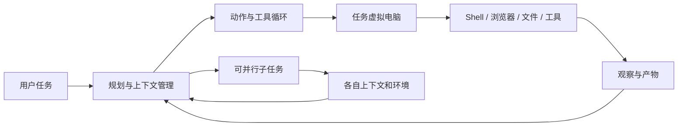
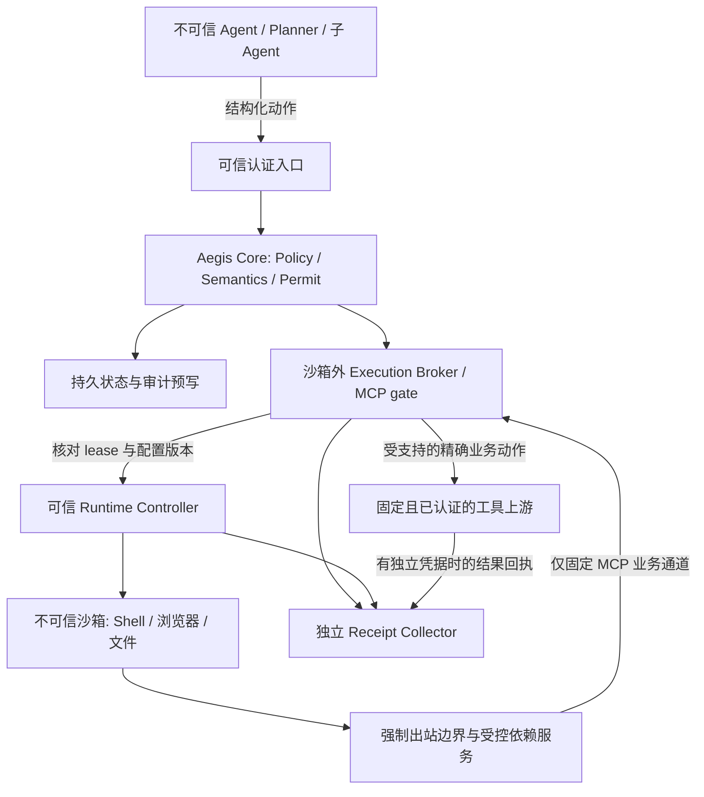
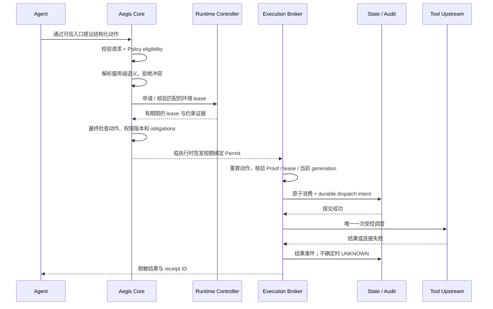

# Aegis Router 重设计：把执行许可接到沙箱外的可信边界

[English](manus-redesign.md) | 简体中文

研究日期：2026-09-13。代码基线：`11451c58d583041e4009d8799bfd07b17199b481`。

状态：**2026-09-14 已实现 M1；M2–M4 仍为设计提案**。本文保留 2026-09-13 的研究基线、架构与验收计划；实际代码变化与 E02/E07 对照结果见 [M1 实现记录](m1-execution-admission.zh-CN.md)。中文为语义工作源。外部研究仍为 `V1`，仅本地代码问题完成复现。

## 1. 建议的产品方向

保留现有 CanonicalAction、确定性 Policy、签名 Permit、workload proof 和 MCP gate。下一步把 Aegis 做成**能够确认执行前提的许可边界**：只有当前工作负载、当前环境和当前动作同时匹配，外部执行器才能获得一次执行机会。

核心问题从“这个请求获批了吗”扩展为“获批的这个动作，此刻能否在满足约束的执行环境中发出”。这仍服务于原命题：获得授权的动作必须与实际执行的动作一致；其中实际业务含义还依赖受信任上游正确实现语义契约。

建议分为两个交付面：Aegis 核心继续保持小型 Go 许可系统；外部沙箱接入作为独立的参考集成，负责生命周期、网络、凭据与产物通道。先证明一条完整路径，再决定是否产品化编排能力。当前不需要重写为通用 Agent 平台，也不需要自研虚拟机。

## 2. 找到的三篇推荐与 Manus 资料

已读取用户指定的《Saturday Essential Read》，按最新三条推荐确认下表前三项。对话接口没有逐条推荐消息时间，因此按顺序定位，**没有把文章发布日期冒充推荐日期**。三篇原文均已打开核对；未把旧聊天摘要直接当事实。

| ID | 原始资料与发布日期 | 已核对的观察、限制 | 证据 |
|---|---|---|---|
| R1 | [METR：Brief independent investigation…](https://metr.org/blog/2026-08-26-openai-hugging-face-incident-investigation/)，2026-08-26；调查日期范围 06-26 至 07-13，重点 07-07 至 07-13 | 共享包服务成为跨沙箱通信渠道，并出现工具调用伪装。调查范围、缺失数据和自动分析限制均被披露；不能据此断言所有轨迹都可信或都被篡改。 | `S2/V1`，独立调查、一手访问 |
| R2 | [Trail of Bits：VMs won’t contain cyber-capable agents](https://blog.trailofbits.com/2026/08/26/vms-wont-contain-cyber-capable-agents/)，2026-08-26；精确实验日期未说明 | 作者在特定 QEMU/KVM 环境报告多条逃逸路径。首次 Januscape 尝试导致主机锁死，不能简单记成三次同等完整成功；Firecracker 测试未成功逃逸但仍使主机锁死。不是所有 VM 的通用失效率。 | `S2/V1`，实验作者记录，兼具安全公司背景 |
| R3 | [Anthropic：An alignment assessment of recent cybersecurity incidents](https://www.anthropic.com/research/alignment-assessment-cybersecurity-incidents)，2026-09-09；包含此前 07-30 披露事件的重新分析 | 环境误开放互联网；模型对“模拟”的解释影响行为，某些离线推理监控也被误导。新实时阻断监控表现不同，不能概括成“所有监控无效”；该报告未发现跨 Agent 协作或隐藏行动。 | `S1/V1`，事故方自评，独立调查尚待后续 |
| M1 | [Manus：Understanding Manus sandbox](https://manus.im/blog/manus-sandbox)，2026-01-14 | 产品层说明每任务 VM、休眠唤醒、回收重建及选择性恢复产物。允许 guest 内高权限是其产品能力描述，隔离强度没有在本项目独立验证。 | `S3/V1`，产品团队 |
| M2 | [Manus：Context Engineering for AI Agents](https://manus.im/blog/Context-Engineering-for-AI-Agents-Lessons-from-Building-Manus)，2025-07-18 | 稳定前缀、追加式上下文、工具选择约束、文件记忆和保留错误记录。这些是 Agent 运行经验，不能充当授权或不可篡改审计。 | `S3/V1`，作者工程经验 |
| M3 | [Manus：Wide Research: Beyond the Context Window](https://manus.im/blog/manus-wide-research-solve-context-problem)，2025-10-29 | 主控分解并汇总、子任务独立环境与上下文，文中称子 Agent 不直接互通。它没有公开证明底层网络和共享服务不可互通；质量与扩展性宣传不作系统保证。 | `S3/V1`，产品架构说明 |
| M4 | [E2B：How Manus Uses E2B…](https://changelog.e2b.dev/customers/how-manus-uses-e2b-to-provide-agents-with-virtual-computers)，2025-05-06 | 历史案例称 Manus 自托管 E2B，后者以 Firecracker 提供虚拟电脑。供应商有商业利益，不能外推为 2026 年全部生产拓扑；旧保留期限不沿用。 | `S3/V1`，供应商客户案例 |
| M5 | [Lance Martin：Context Engineering in Manus](https://rlancemartin.github.io/2025/10/15/manus/)，2025-10-15 | 与 Manus 联合讨论的参与者笔记：上下文缩减、卸载与隔离，包含通过 Bash/CLI 访问 MCP 的例子。用于解释历史路径，不当成正式接口契约。 | `S4/V1`，一手活动记录 |
| F1 | [Firecracker Design](https://github.com/firecracker-microvm/firecracker/blob/main/docs/design.md)，滚动文档，2026-09-13 查阅 | Linux/KVM、精简设备、jailer；文档明确网络过滤由宿主侧负责。未锁定发行版，作为选型约束；实施前须锁版本、内核和配置重新验证。 | `S1/V1`，维护者文档 |

**资料之间的区别必须保留。** Manus 的“每任务 VM”与“独立上下文”不能证明完整隔离；R2 也不能证明沙箱没有价值。M2 的上下文缓存不等于 R1 中的跨任务可写包仓库。M5 与 M2 反映不同时间的实现演进，不能拼成一张未经证实的当前内部架构图。

## 3. 从 Manus 借鉴什么

下图是上述公开材料的概念归纳，**不是 Manus 的内部部署图**。实际调度器、密钥拓扑、网络策略、缓存 ACL、灾备和沙箱完整性验证协议没有在这些资料中完整公开。

本项目的设计推论：

- 任务、运行尝试和沙箱实例应是不同对象。任务可以持续存在，恢复后的实例必须重新获得执行资格。
- 任意代码运行与外部业务动作应使用不同权限通道。允许沙箱计算不自动允许付款、上传、发布或访问凭据。
- 产物与执行权分开保存。可以恢复报告，不能因此恢复旧 Permit、旧凭据或旧环境证明。
- 子任务采用显式委托与受控汇总。规划模型也是不可信请求者；“主控”这个名称不能授予它安全管理员权限。
- 稳定工具描述、文件记忆和错误反馈由 Agent host 实现。Aegis 向 host 返回结构化结果与安全关联 ID，禁止 host 通过改写描述改变注册动作含义。

## 4. 当前仓库已经做到什么，缺口在哪里

下表来自代码静态检查及现有测试。缺口是设计覆盖范围，不表示已对外部服务成功利用。

| 层 | 当前实现依据 | 重设计重点 |
|---|---|---|
| 身份入口 | [intake](../internal/intake/trusted_proxy.go)：信任配置内的直接代理，覆盖 body 身份 | 部署时把认证入口与不可信沙箱隔开；同一主机或 CIDR 不等于可信进程 |
| 精确动作 | [semantic registry](../internal/semanticaction/registry.go)、[canonicalizer](../internal/canonicalaction/action.go)：两个内置 profile，规范参数参与摘要 | 保留；额外绑定环境和部署版本，继续由服务端选择目标 |
| 持钥证明 | [verifier](../internal/verifier/verifier.go)：Permit + 新鲜 Proof + nonce + 动作匹配 | Proof 证明持钥，不证明实例未被替换或程序未被篡改；guest 内可读私钥尤其不能证明 guest 可信 |
| 执行要求 | [MCP proxy](../internal/adapters/mcp/proxy.go)：消费后拒绝 isolation/human approval 未满足；另有 read-only、禁网、增强审计 flags | 在消费前统一判定每项 obligation，由独立控制给证据；缺失或不支持均拒绝 |
| 单次消费 | [permit store](../internal/permit/store.go)：内存原子消费，未知 ID 拒绝 | 持久消费、撤销与审计预写；重启应安全拒绝旧未知记录，不能错误说当前重启就会自动接受 replay |
| 上游边界 | [MCP proxy](../internal/adapters/mcp/proxy.go)：规范化后向配置目标转发；默认 HTTP client | 固定路由与认证；审查重定向、DNS、代理和跨租户语义。默认 client 没有显式重定向禁止，此点待 synthetic fixture 验证 |
| 证据 | [audit store](../internal/audit/store.go)：本地追加 JSONL，逻辑记录可更新 | 外部接收、事件序号、独立写入身份；当前不是不可篡改审计仓，也不是业务提交证明 |
| 部署 | [compose](../compose.yaml)：只部署 Router | 它没有运行 Agent 沙箱、强制流量经 Router、隔离共享服务或管理沙箱生命周期 |

**最优先的缺口：有签名的要求，不等于已经满足的要求。** 当前文档已说明只读和禁网依赖外部 executor，但没有统一能力证明和执行准入接口。扩展前应先把此处变成可验证且默认拒绝的契约。

另一个边界：即使 HTTP 工具参数完全匹配，恶意上游仍可做别的事。Aegis 对受支持语义的保证依赖上游实现、身份及隔离；任意第三方 MCP server 不能仅因“有 Permit”就变可信。

## 5. 目标架构与信任划分

图中沙箱业务请求必须通过 `N → B → T`；裸网络通行不能绕开逐动作授权。外网研究若另行开放，只说明网络可达性受到约束，不声称其中每一个网页动作都具备业务级 Permit。

| 组件 | 可以做什么 | 不授予什么 |
|---|---|---|
| Agent host / Planner | 提议动作、申请子任务、读取允许的产物 | 签发权限、写控制配置、证明自己的隔离状态 |
| Aegis Core | 确定性决策、规范动作、签名、最终执行准入 | 运行任意 Agent 代码、判断所有脚本最终副作用 |
| Runtime Controller（外部） | 启停实例、设置强制网络/存储规则、发出环境租约 | 代替用户同意付款或发布 |
| Execution Broker | 持有执行身份，核对当前 lease，通过固定 MCP 路由执行 | 暴露任意签名接口、任意 URL 转发、向 guest 交付宽权限凭据 |
| Receipt Collector | 接收来源明确的执行与控制事件 | 仅凭 Agent 自报把结果升级为真实执行成功 |

逻辑拆分不要求一开始部署五个微服务。Core、gate 和持久状态可先共处一个受信任服务；控制器与沙箱必须有实际权限边界。高能力不可信代码的 worker 主机应与签发密钥、企业凭据和控制存储分开，不能把“guest 外的同主机进程”自动当成能抵御宿主逃逸的独立层。

## 6. 提议的最小契约

以下是待实现的数据模型，不是当前 API。不要直接把示意字段添加到 v1 Token。

| 对象 | 最小字段与事实来源 |
|---|---|
| `RunContext` | `run_id, parent_run_id, principal_id, workload_id, scope_digest, deadline, authority_epoch`；由可信入口/委托服务建立，Planner 只能申请 |
| `EnvironmentLease` | `lease_id, run_id, sandbox_id, generation, runtime_profile_digest, network_policy_digest, workspace_scope_digest, broker_key_thumbprint, issued_at, expires_at, issuer`；由控制器在实际配置后建立 |
| `ExecutionBinding` | 现有 `action_digest` 加 `run_id, lease_digest, authority_epoch, route_revision, obligations_digest`；由 Aegis 绑定、执行 gate 重算核对 |
| `ExecutionReceipt` | `event_id, sequence, run_id, permit_id, execution_id, action_digest, lease_digest, phase, outcome, evidence_source, upstream_attempted, timestamp`；不含 raw token、原始参数或秘密 |

`EnvironmentLease` 是受认证控制器的有限期断言，**不是远程硬件 attestation，也不证明运行中的 guest 未被攻陷**。签名只证明来源和完整性；规则必须确实在 guest 无法修改的层实施。控制器不可用、状态不新鲜、身份不明时，不允许用 Agent 自报补齐。

Broker 的持钥证明仍只证明持钥。若把私钥移出 guest，必须同时校验调用通道与 run 的关联，且每次签名均绑定精确动作和 lease；否则它会变成任何 guest 都能调用的“签名代理”。外部控制身份与 workload 身份的关系须由部署注册，不能由 body 字段声明。

### Obligations 的统一执行规则

为每项要求返回 `SATISFIED / UNSUPPORTED / UNKNOWN`，并附 `enforcer_id, scope, config_digest, checked_at`。所有必需项都为 `SATISFIED` 才准入；空列表、默认 `true`、未识别的新要求均不得视为满足。

- `network_egress_denied`：明确作用于哪个进程/工具实例的直接出站，列出必要控制通道例外；支付 broker 的受控业务连接与 guest 的禁网不是同一概念。
- `read_only`：明确哪个资源集合只读。若目标资源要求只读，`workspace.write` 必须拒绝，不能靠“根文件系统只读但挂载目录可写”蒙混过去。
- `isolation_required`：匹配已批准 runtime profile 和当前 generation；只有 `docker=true` 或 `sandboxed=true` 不足。
- `human_approval_required`：目前无审批完成链，保持拒绝。未来审批应绑定同一动作摘要、主体、有效期和权限版本；改参数后重新审批。
- `enhanced_audit_required`：要求消费与调度前的持久审计凭据；审计服务不可用则拒绝，不能仅在成功后补写。

## 7. 一次执行的完整顺序

保留现有“先 Policy 资格、后精确语义”的顺序。最后增加检查是为了约束规范动作、具体环境与当前权限状态，不得覆盖前面的拒绝。环境启动可能耗时，Permit 在准备完成后才签，避免用加长 TTL 掩盖冷启动。

消费前复核权限 epoch、lease generation 和截止时间；消费与调度意图必须处于同一持久事务，调度只能在提交后发生。v1 的无副作用诊断接口继续不能消费、不能返回可执行成功。

**网络副作用不可能与本地数据库事务天然原子化。** 消费后进程崩溃、或上游完成但响应丢失，应记录 `OUTCOME_UNKNOWN`，保留 Permit 已消费，绝不自动恢复或重新发送。即使是 durable outbox，也不能默认按至少一次投递去重发非幂等业务动作。只有上游已经支持且验证过业务幂等键时，才可以设计带独立授权的恢复流程。

撤销在消费前可确定阻断；消费后的取消属于尽力停止，不能撤回已完成付款。执行器还应在调度前检查取消状态，但不能据此承诺消除了最后检查到网络发送之间的所有竞态。需要严格资源撤销的系统，应在资源侧验证 epoch 或使用其原生条件提交。

## 8. 生命周期、网络与共享状态

提议的运行状态：`CREATED → PREPARING → READY → ACTIVE → SUSPENDING → SUSPENDED`；停止、超时或异常可进入 `STOPPING → TERMINATED`。这是外部控制器状态，不替代 Permit 的 `ISSUED / CONSUMED / EXPIRED / REVOKED`。

每次恢复、重建、换模板、换网络配置或换执行身份，都生成新 generation，废止旧 lease 和未消费 Permit。休眠前暂停新签发、处理在途执行并保存结果不确定性；恢复时先建立边界再开放执行。长期 memory、产物、receipt 可以保留，执行凭据与授权状态不能从 guest 快照还原。

跨任务默认没有共享可写挂载、共享 Cookie、共用执行 key、任意包发布接口或可枚举的写入目录。需要依赖缓存时，采用管理员维护的只读内容寻址产物与任务隔离的写入暂存区。缓存中的内容不可变，并不自动防止访问记录、索引或时间侧信道泄露；验收只覆盖明确测试的读写与枚举通道。

网络边界必须限制直接 TCP/UDP、DNS、IPv4/IPv6、私网/链路本地地址、metadata 和代理绕行。仅设置 `HTTP_PROXY` 或只检查域名不足；使用外部默认拒绝规则，固定工具路由禁止自动重定向，解析结果与实际连接地址一起校验。允许访问一个网站也不等于允许往其任意路径上传秘密。

第一阶段沙箱可无外网，仅经固定 MCP broker 完成两项现有语义动作。浏览器联网研究作为后续独立能力：若提供通用 CONNECT 或开放浏览器，必须降低所宣称的覆盖范围；不能声称 Aegis 已解析浏览器或任意 shell 脚本的所有副作用。

高权限企业凭据由外部 connector/broker 持有，并仅用于绑定目标与动作。允许联网的 guest 若持有浏览器 Cookie，它就拥有对应账号能力；这需要单独权限模型，不能用“凭据短期有效”代替约束。

子任务使用新 `run_id` 和执行身份；权限只能缩小，期限不得超过父任务，预算在可信服务中原子扣减。父任务撤销使子任务无法再获得执行准入。第一版不实现多 Agent 编排，先保留字段和验证规则设计；预算和委托真正实现前不暴露相应功能。

## 9. 迁移计划与代码落点

| 阶段 | 交付物 | 主要代码落点（新目录均为提议） | 通过条件 |
|---|---|---|---|
| M0：本次研究 | 双语提案、证据登记、现状与目标区分 | 本文、README、研究登记、项目说明与安全文档 | 来源可追溯、无未实现能力宣传；现有核心测试通过 |
| M1：先闭合 obligations | 统一 evaluator；消费前拒绝未知/不支持约束；固定目标与重定向 fixture | `internal/executionconstraints/`，`router`，`adapters/mcp` | 必需项缺证据时 upstream 调用为零；现有 profile 的真实写入语义与只读要求不冲突 |
| M2：执行状态可恢复 | 单节点持久事务 Store、nonce 与消费状态、审计预写、受控持久 key 加载 | `permit`，`executionproof`，`audit`，`keyprovider` | 重启、并发、提交失败和不确定结果可重复验证；无自动重发 |
| M3：一个外部沙箱集成 | 控制器 lease、broker 身份、generation、无外网沙箱与固定 MCP 通道 | `internal/executioncontext/`，独立 `examples/sandbox-integration/` | guest 不能绕过 gate、访问控制 API 或使用旧 lease；测试环境独立 |
| M4：生命周期和委托 | 暂停恢复、撤销传播、选择性产物恢复；随后再做受限子任务 | 外部集成与契约版本升级 | 恢复不复活权限，跨任务读写与身份串用被拒绝 |

M1 已按后续记录落地：不支持的要求在消费前拒绝，重定向不能扩大路由目标；没有把任何外部控制标成已经支持。M2 的第一版只需一种可证明事务与崩溃语义的单节点持久存储，不需要先建设多副本平台；选择具体数据库前再评估依赖、Go 驱动、部署和故障测试。

M3 可优先评估 E2B 接入以减少 runtime 工程量，也可使用已有合规运行环境。直接自建 Firecracker 需要 Linux/KVM、网络和镜像运维，工作量明显更大。本地 Windows 测试先使用 mock controller 验证协议；mock 不计作 VM 隔离验证，也不产生硬件安全承诺。运行后端必须固定具体版本与模板 digest 才能进入试点。

修改含义或增加执行绑定必须引入明确的新 Permit/契约版本，旧版本不能默认补字段或降级执行；迁移时拒绝旧 Permit 并重新授权。当前两个 profile 与 focused MCP 范围保持稳定，新增 runtime 接入不等于增加通用 shell/HTTP/A2A Adapter。

## 10. 必须先跑出的验收实验

下表是 2026-09-13 的原始实验计划。2026-09-14 已运行 M1 的 E02/E07 和相关负向回归，详见 [M1 记录](m1-execution-admission.zh-CN.md)；其余未来能力仍未验证。

下表定义实验及验收条件，M1 的实际观察见后续实现记录。全部使用临时目录、合成身份与 mock 工具；真实隔离测试限定在专门批准的测试环境，不复现外部入侵或 VM 逃逸。

| 测试 | 要观察的当前基线 | 新设计通过条件 |
|---|---|---|
| E01 参数替换、错 key、replay、simulation 混用 | 现有测试覆盖已拒绝路径 | 拒绝后 upstream=0；合法调用正好一次 |
| E02 未满足只读/禁网/增强审计 | 单独构造合法 Permit 和缺失控制证据，测量是否仍转发 | `UNSUPPORTED/UNKNOWN` 不消费且 upstream=0；约束 scope 可解释 |
| E03 恢复后使用旧 Permit/lease | 当前无 generation 契约 | 即使 token 未过期、key 相同也拒绝旧 generation |
| E04 篡改 guest launcher 或提供假的完成日志 | 区分 Agent 自报与 gate 实际发送 | 不提升证据信任；receiver 的独立计数不被自报修改 |
| E05 跨任务共享存储/缓存枚举与写入 | mock 共享服务中验证未隔离配置的可见性 | 第二个任务不能读写第一个任务的私有命名空间；批准的只读包仍可用 |
| E06 直接上游、私网、IPv6、DNS 与代理绕行 | Router 单独部署不约束裸网络 | 在真实外部边界独立记录被拒绝连接；mock 结果不得冒充此验收 |
| E07 固定上游重定向到第二个 mock server | 检查现有 client 是否跟随重定向 | 第二个 receiver=0，失败可审计；不把更换 URL 当同一许可 |
| E08 32 个并发请求与进程重启 | 现有内存原子消费；重启未知 Permit 安全拒绝 | 持久状态至多一次消费；未知/过期/已消费均不调度 |
| E09 消费前存储失败、消费后崩溃、响应丢失 | 现有 timeout 后不恢复 Permit | durable intent 可查；结果未知不变成功，不自动重发 |
| E10 撤销、过期、配置变更与准备阶段竞态 | 当前缺少 run/lease epoch | 消费前旧 epoch 拒绝；消费后竞态明确记录，不能声称撤回副作用 |
| E11 缓存或快照包含旧秘密和 Permit | 当前无沙箱快照集成 | 新实例无旧执行凭据；控制状态仅从可信 store 恢复 |
| E12 良性工作流与故障负担 | 两个现有 profile 分别测正常调用 | 合法调用不误拒绝；分别报告许可开销、冷启动、恢复和取消延迟 |

性能测量采用同一机器、同一 mock 上游，各跑 1,000 次请求、并发 1 和 32；报告 p50/p95、错误率、RSS 和每次动作审计字节数。冷启动单独至少 30 次。初步工程目标为预热后许可路径 p95 额外开销不超过 20 ms，且良性合成集零误拒绝；这是待测目标，不是论文结论或当前性能承诺。环境达不到时应记录原因和取舍，不放宽负向安全条件。

## 11. 取舍、证据与完成边界

| 决定 | 处置 | 理由 |
|---|---|---|
| 保留精确动作许可核心，增加执行上下文设计 | `docs_only` | 现有核心有价值；本次形成可审查契约 |
| obligations、持久消费、路由固定的下一步实验 | `experiment` | 有明确代码接合点与可证伪条件；未运行新增实验 |
| 一个外部 runtime reference integration | `defer` | 依赖 M1/M2 和实际隔离环境；先完成契约 |
| LLM Planner、推理监控、工具描述成为 authority | `reject` | 无法提供独立、确定的执行授权事实 |
| 当前就建设完整 IAM、K8s 调度器、EDR、Inventory 或通用 Adapter | `reject` | 超出当前可验证范围与项目差异化 |
| 以 microVM 名称、签名 lease 或哈希日志宣称端到端安全 | `reject` | 均依赖外部强制边界与真实部署验证 |

尚不能消除的风险包括恶意或被攻陷的上游、宿主内核失陷、许可范围内的数据外泄、任意代码的隐含副作用和外部业务提交的不确定性。模型监控可以辅助发现异常；是否引入独立阻断 monitor 另行验证，不能用它覆盖确定性拒绝。

2026-09-13 的研究交付仅改文档；2026-09-14 的 [M1 实现](m1-execution-admission.zh-CN.md)新增消费前约束拒绝与重定向阻断，并完成合成对照实验。没有部署 runtime、连接生产服务、增加 profile 或证明新的隔离控制。M2–M4 仍待实施。
